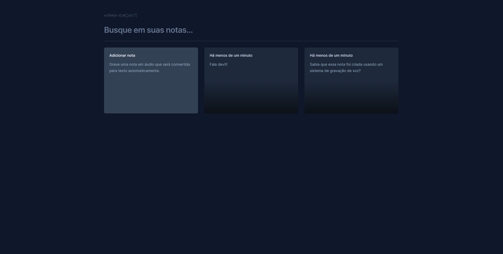

<h1 align="center"> Expert Notes </h1>

Uma aplicação totalmente prática e responsiva pra você criar e gerenciar suas notas. 
 

  

## 🚀 Tecnologias

Esse projeto foi desenvolvido com as seguintes tecnologias:

- TypeScript
- React
- TailWindCss
- Vite
- HTML
- Radix
- Git e Github

## 💻 Projeto

Esse projeto foi desenvolvido durante o NLW EXPERT da RocketSeat.
Esse projeto consiste em um sistema de gerenciamento de notas com gravação de voz.

- [Acesse o projeto finalizado, online](https://expert-notes-phi.vercel.app/)

Feito com ♥ por Rian Britto
